# Bulwriter

A collaborative screenwriting platform that doesn't stop at the page: real-time co-writing with Git-style version control, wrapped around a full indie-film production pipeline — story bible, scene breakdown, budgeting, casting, location scouting, scheduling, shot lists, and release tracking.

Live Website: [Bulwriter](https://d1hspb5r4tyd4l.cloudfront.net/)

## Architecture

```mermaid
%% Generated by https://gitdiagram.com/somunaexe/bulwriter
flowchart TD

subgraph group_client["Angular client"]
  node_routes["App routes<br/>[app.routes.ts]"]
  node_dashboard["Project dashboard"]
  node_projectui["Project workspace"]
end

subgraph group_authoring["Screenplay authoring"]
  node_editorui["Script editor"]
  node_syncclient["Collab session<br/>[sync.service.ts]"]
  node_screenplay["Screenplay model"]
  node_fountain["Fountain interchange<br/>[fountain-export.ts]"]
  node_vcui["Branch history UI"]
  node_diffui["Draft comparison"]
  node_vcclient["Version control client"]
end

subgraph group_backend["Backend services"]
  node_api["REST API<br/>[api.go]"]
  node_hub["WebSocket hub<br/>[hub.go]"]
  node_snapshots[("Snapshots and branches<br/>[snapshot.go]")]
end

subgraph group_production["Film production"]
  node_breakdown[("Scene breakdown<br/>[breakdown.go]")]
  node_schedule[("Production schedule<br/>[schedule.go]")]
  node_casting[("Casting<br/>[casting.go]")]
  node_budget[("Budget<br/>[budget.go]")]
  node_scouting[("Location scouting<br/>[scouting.go]")]
  node_shotlist[("Shot list<br/>[shotlist.go]")]
  node_presskit[("Press kit<br/>[presskit.go]")]
  node_productionui["Production tools UI"]
end

subgraph group_platform["Projects and access"]
  node_projects[("Project and script data<br/>[project.go]")]
  node_membership[("Membership and invites<br/>[membership.go]")]
  node_auth["Identity client<br/>[clerk.service.ts]"]
end

node_writer(("Writer"))

node_writer -->|"opens workspace"| node_routes
node_routes -->|"routes to"| node_dashboard
node_routes -->|"routes to"| node_projectui
node_routes -->|"routes to"| node_editorui
node_dashboard -->|"opens project"| node_projectui
node_projectui -->|"opens script"| node_editorui
node_editorui -->|"starts session"| node_syncclient
node_syncclient -.->|"syncs updates"| node_hub
node_hub -.->|"broadcasts updates"| node_syncclient
node_syncclient -->|"builds editor"| node_screenplay
node_syncclient -->|"exports text"| node_fountain
node_editorui -->|"imports and exports"| node_fountain
node_editorui -->|"saves drafts"| node_vcclient
node_editorui -->|"shows branches"| node_vcui
node_editorui -->|"shows diffs"| node_diffui
node_vcui -.->|"requests history"| node_vcclient
node_diffui -.->|"requests comparison"| node_vcclient
node_vcclient -.->|"calls REST"| node_api
node_api -->|"reads and writes"| node_snapshots
node_api -.->|"routes WebSocket"| node_hub
node_api -->|"reads and writes"| node_projects
node_api -->|"checks access"| node_membership
node_auth -.->|"authenticates"| node_writer
node_editorui -->|"opens production tools"| node_productionui
node_api -->|"serves breakdown"| node_breakdown
node_api -.->|"serves schedule"| node_schedule
node_api -->|"serves casting"| node_casting
node_api -->|"serves budgets"| node_budget
node_api -->|"serves scouting"| node_scouting
node_api -->|"serves shot lists"| node_shotlist
node_api -->|"serves press kits"| node_presskit

click node_routes "https://github.com/somunaexe/bulwriter/blob/main/frontend/src/app/app.routes.ts"
click node_dashboard "https://github.com/somunaexe/bulwriter/blob/main/frontend/src/app/components/dashboard/dashboard.component.ts"
click node_projectui "https://github.com/somunaexe/bulwriter/blob/main/frontend/src/app/components/project/project.component.ts"
click node_editorui "https://github.com/somunaexe/bulwriter/blob/main/frontend/src/app/components/editor/editor.component.ts"
click node_syncclient "https://github.com/somunaexe/bulwriter/blob/main/frontend/src/app/services/sync.service.ts"
click node_screenplay "https://github.com/somunaexe/bulwriter/blob/main/frontend/src/app/editor/screenplay-schema.ts"
click node_fountain "https://github.com/somunaexe/bulwriter/blob/main/frontend/src/app/editor/fountain-export.ts"
click node_vcui "https://github.com/somunaexe/bulwriter/blob/main/frontend/src/app/components/branch-panel/branch-panel.component.ts"
click node_diffui "https://github.com/somunaexe/bulwriter/blob/main/frontend/src/app/components/diff-viewer/diff-viewer.component.ts"
click node_vcclient "https://github.com/somunaexe/bulwriter/blob/main/frontend/src/app/services/version-control.service.ts"
click node_api "https://github.com/somunaexe/bulwriter/blob/main/backend/internal/api/api.go"
click node_hub "https://github.com/somunaexe/bulwriter/blob/main/backend/internal/hub/hub.go"
click node_snapshots "https://github.com/somunaexe/bulwriter/blob/main/backend/internal/snapshot/snapshot.go"
click node_projects "https://github.com/somunaexe/bulwriter/blob/main/backend/internal/project/project.go"
click node_membership "https://github.com/somunaexe/bulwriter/blob/main/backend/internal/membership/membership.go"
click node_auth "https://github.com/somunaexe/bulwriter/blob/main/frontend/src/app/services/clerk.service.ts"
click node_breakdown "https://github.com/somunaexe/bulwriter/blob/main/backend/internal/breakdown/breakdown.go"
click node_schedule "https://github.com/somunaexe/bulwriter/blob/main/backend/internal/schedule/schedule.go"
click node_casting "https://github.com/somunaexe/bulwriter/blob/main/backend/internal/casting/casting.go"
click node_budget "https://github.com/somunaexe/bulwriter/blob/main/backend/internal/budget/budget.go"
click node_scouting "https://github.com/somunaexe/bulwriter/blob/main/backend/internal/scouting/scouting.go"
click node_shotlist "https://github.com/somunaexe/bulwriter/blob/main/backend/internal/shotlist/shotlist.go"
click node_presskit "https://github.com/somunaexe/bulwriter/blob/main/backend/internal/presskit/presskit.go"
click node_productionui "https://github.com/somunaexe/bulwriter/blob/main/frontend/src/app/components/stripboard/stripboard.component.ts"

classDef toneNeutral fill:#f8fafc,stroke:#334155,stroke-width:1.5px,color:#0f172a
classDef toneBlue fill:#dbeafe,stroke:#2563eb,stroke-width:1.5px,color:#172554
classDef toneAmber fill:#fef3c7,stroke:#d97706,stroke-width:1.5px,color:#78350f
classDef toneMint fill:#dcfce7,stroke:#16a34a,stroke-width:1.5px,color:#14532d
classDef toneRose fill:#ffe4e6,stroke:#e11d48,stroke-width:1.5px,color:#881337
classDef toneIndigo fill:#e0e7ff,stroke:#4f46e5,stroke-width:1.5px,color:#312e81
classDef toneTeal fill:#ccfbf1,stroke:#0f766e,stroke-width:1.5px,color:#134e4a
class node_routes,node_dashboard,node_projectui toneBlue
class node_editorui,node_syncclient,node_screenplay,node_fountain,node_vcui,node_diffui,node_vcclient toneAmber
class node_api,node_hub,node_snapshots toneMint
class node_breakdown,node_schedule,node_casting,node_budget,node_scouting,node_shotlist,node_presskit,node_productionui toneRose
class node_projects,node_membership,node_auth,node_writer toneIndigo
```



```
bulwriter/
├── backend/               Go — REST API + WebSocket sync hub + Postgres
│   ├── cmd/server/        Entry point
│   ├── db/migrations/     Postgres schema, applied automatically on boot
│   └── internal/
│       ├── api/           HTTP router (REST + WebSocket upgrade)
│       ├── hub/           Real-time Yjs relay (WebSocket rooms)
│       ├── snapshot/      Version control engine (branches, snapshots, diffs)
│       ├── middleware/    Clerk JWT auth, per-project roles, rate limiting
│       ├── project/       Projects, scripts, trash
│       ├── membership/    Collaborator roles and invites
│       ├── story/         Story bible (core question, genre/tone/theme, idea notes)
│       ├── breakdown/     Scene-by-scene cast/props/costumes/set-dressing tags
│       ├── budget/        Rate-based estimate + line items (some linked to a
│       │                  highlighted span of the script itself)
│       ├── casting/       Roles, candidates, audition status
│       ├── crew/          Crew list (role, contact)
│       ├── scouting/      Location candidates and photos
│       ├── schedule/      Shooting-schedule strips grouped by day
│       ├── shotlist/      Shot list & storyboards per scene
│       ├── rehearsal/     Rehearsal log
│       ├── continuity/    Continuity notes per scene
│       ├── musicvfx/      Music & VFX cue tracking per scene
│       ├── milestone/     Post-production milestones
│       ├── credits/       Cast/crew/additional credits roll
│       ├── presskit/      Synopsis, stills, bios, poster
│       ├── distribution/  Festival submissions and release links
│       ├── donation/      Stripe Checkout + webhook for one-off/monthly donations
│       └── anthropic/     Claude API client (story-bible generation; wired
│                          server-side, its UI entry point is currently
│                          disabled pending a billing decision)
└── frontend/              Angular 17 + TypeScript
    └── src/app/
        ├── services/
        │   ├── sync.service.ts             Yjs + ProseMirror session
        │   ├── version-control.service.ts  REST client for VC API
        │   └── clerk.service.ts            Auth session (Clerk)
        ├── editor/        Screenplay schema, Fountain/DOCX/HTML import-export,
        │                  pagination experiments (shelved — see git history)
        └── components/    One component per feature above, plus:
            ├── editor/              Main editor shell
            ├── branch-panel/        Sidebar: branches + history
            ├── diff-viewer/         Side-by-side draft comparison
            ├── collaborator-stack/  Presence avatars, invites, crew
            ├── workflow-overview/   Cross-feature production-phase dashboard
            ├── donate/              Public donations page
            ├── privacy/, terms/     Legal pages
            └── trash/               Soft-deleted projects
```

## How it works

### Real-time sync (Yjs + WebSocket)
- Each script has a **room** on the Go WebSocket hub (keyed by `scriptId`)
- The Angular client creates a `Y.Doc` and connects via `WebsocketProvider`
- Every keystroke produces a small binary **Yjs update** — the CRDT operation
- The hub broadcasts it to all other writers in the room
- A writer joining mid-session receives the full log replay and converges to the current state
- **No conflicts possible** — CRDTs merge mathematically, no manual resolution needed
- Collaborator presence (cursor colors, name labels, an avatar stack) rides the same `y-prosemirror` awareness channel

### Version control (snapshots + branches)
- Writers explicitly save named **snapshots** ("Act II rewrite") — these are immutable, persisted in Postgres
- A **branch** is a named pointer to the tip snapshot, just like a Git branch — every new script gets a `pilot` branch and snapshot automatically
- The **diff** endpoint computes a line-level Myers diff between any two snapshots
- Branching lets a writer explore an alternate ending without touching the main draft
- Unsaved keystrokes also autosave to a per-branch draft slot, independent of named snapshots

### Screenplay authoring
- A dedicated ProseMirror schema for industry screenplay elements (scene heading, action, character, dialogue, parenthetical, transition, shot, lyrics, dual dialogue, sequence, notes)
- Fountain import/export for interchange with other screenwriting tools, plus DOCX/HTML/PDF export
- A real-time element toolbar and keyboard shortcuts (`Ctrl/⌘ 1–0`) for switching line types

### Production toolkit
Everything from the Production/Post-Production/Distribution menus feeds the **Workflow overview** dashboard, which tracks progress across the whole pipeline from one screen:
- **Story bible** — core question, genre/tone/theme, and a reorderable list of idea notes
- **Scene breakdown** — per-scene cast, props, costumes, and set-dressing tags, with a CSV export
- **Budget** — per-unit rate estimate (shoot days/locations/cast/props) plus freeform line items; a line item can be tied directly to a highlighted span of script text, so clicking it jumps back to exactly where it came from
- **Casting** — roles, candidates, audition status, contact and notes
- **Location scouting** — candidate locations with photos, addresses, and notes
- **Shooting schedule** — a day-by-day stripboard with call sheets and a daily wrap log
- **Shot list & storyboards** — per-scene shots with size/angle/movement and a storyboard image
- **Rehearsals**, **continuity notes**, and **music & VFX** tracking, each scoped to a scene
- **Milestones**, **credits**, **press kit**, and **festival & release** tracking for post-production and distribution

### Auth, access, and payments
- **Clerk** handles sign-in; the Go backend verifies session JWTs itself (no round-trip to Clerk per request)
- Per-project roles (owner/editor/viewer) and email invites via the membership service
- A public **donations** page (Stripe Checkout, one-off or monthly) with webhook-verified confirmation, independent of the authenticated app

### Reliability and legal
- **Sentry** error tracking on both the Angular frontend and the Go backend
- A committed **Privacy Policy** and **Terms of Service**
- Licensed [AGPL-3.0](#license) — see below

## Quick start

### Backend
```bash
cd backend
# needs: DATABASE_URL (Postgres), CLERK_SECRET_KEY, CLERK_FRONTEND_API
# optional: STRIPE_SECRET_KEY, STRIPE_WEBHOOK_SECRET, SENTRY_DSN,
#           ANTHROPIC_API_KEY, FRONTEND_URL, PORT
go run ./cmd/server
# Migrations in db/migrations/ run automatically on boot.
# Listening on :8080 (or $PORT)
```

### Frontend
```bash
cd frontend
npm install
ng serve
# Dev server on http://localhost:4200
```

Open two browser tabs — both connect to the same script room and sync live.

### Tests
```bash
# Backend — spins up against a real Postgres (DATABASE_URL), skips cleanly if unset
go test ./... -race

# Frontend
cd frontend && npx ng test --no-watch --browsers=ChromeHeadlessNoSandbox
```

## Tech stack
| Layer | Technology |
|---|---|
| Frontend | Angular 17, TypeScript |
| Script editor | ProseMirror |
| Real-time sync | Yjs (y-prosemirror, y-websocket) |
| Backend API | Go, gorilla/mux, gorilla/websocket |
| Version control | Custom Go package (Myers diff) |
| Auth | Clerk (JWT verified server-side via `lestrrat-go/jwx`) |
| Database | Postgres (`lib/pq`) |
| Payments | Stripe Checkout + webhooks |
| Error tracking | Sentry (frontend + backend) |
| AI assist | Anthropic Claude API (story-bible generation; currently gated off in the UI) |
| CI/CD | GitHub Actions — backend/frontend test suites on every PR, sync-to-S3 on merge to `main` |

## License

Copyright (C) 2026 Bulwriter

Bulwriter is free software, licensed under the [GNU Affero General Public
License v3.0](LICENSE) (AGPL-3.0). You're free to use, modify, and
self-host it — if you run a modified version as a network service, the
AGPL requires offering its source to that service's users too, which is
what keeps community improvements from being closed off in a competing
hosted fork.
